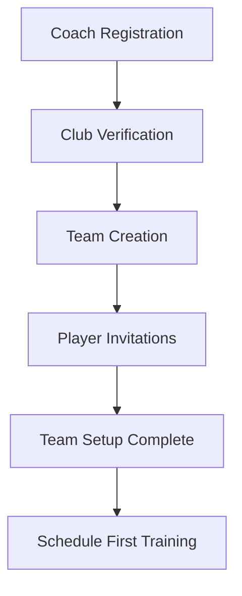
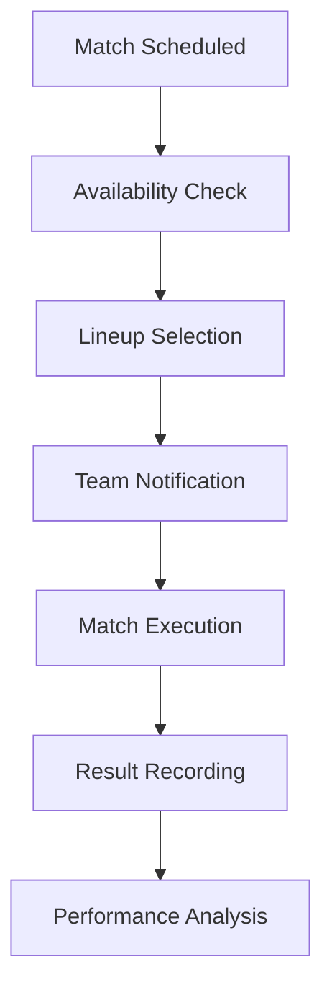

# Coachify - Football Team Management Application
## Product Requirements Document

## 1. Product Overview and Vision

Coachify is a comprehensive football team management application designed specifically for small football teams and clubs. The platform streamlines team operations, player management, match organization, and performance tracking through an intuitive digital solution.

**Vision:** To become the leading digital platform that empowers small football teams worldwide by simplifying team management, enhancing player development, and fostering better communication between all stakeholders in amateur and semi-professional football.

**Key Problems Solved:**
- Manual and fragmented team management processes
- Poor communication between coaches, players, and management
- Lack of structured performance tracking and analytics
- Inefficient scheduling and attendance management
- Limited financial oversight for small clubs

## 2. Target Users

### 2.1 User Roles and Registration Methods

| Role | Registration Method | Core Permissions |
|------|---------------------|------------------|
| Technical Director/Coach | Email + Club Verification | Full team management, player analytics, tactical planning |
| Player | Email/Phone + Team Invitation | View schedules, update availability, access performance data |
| Club President/Admin | Email + Club Creation | Club-wide management, financial oversight, multiple team access |
| Assistant Coach | Coach Invitation | Limited team management, player data access |
| Team Manager | Coach Invitation | Schedule management, communication coordination |

### 2.2 User Characteristics

**Technical Directors/Coaches:**
- Age: 25-65 years
- Football coaching experience: 2-20+ years
- Tech comfort level: Medium to High
- Primary needs: Team organization, tactical planning, player development

**Players:**
- Age: 16-35 years
- Tech comfort level: High (mobile-first users)
- Primary needs: Schedule access, performance tracking, team communication

**Club Presidents:**
- Age: 30-70 years
- Business management background
- Tech comfort level: Medium
- Primary needs: Financial oversight, club growth, stakeholder management

## 3. Core Features by User Role

### 3.1 Technical Director/Coach Features
- **Team Management Dashboard**: Overview of all team activities, upcoming matches, player status
- **Player Database**: Complete player profiles with statistics, medical records, contract details
- **Training Session Planner**: Create and manage training schedules with drill libraries
- **Tactical Board**: Digital tactical planning with formation setups and play drawing
- **Performance Analytics**: Individual and team performance metrics, trend analysis
- **Communication Hub**: Team announcements, individual messaging, group discussions
- **Match Analysis**: Post-match statistics, video analysis integration, opponent scouting

### 3.2 Player Features
- **Personal Dashboard**: Individual performance metrics, upcoming schedule, team news
- **Availability Management**: Mark availability for matches and training sessions
- **Performance Tracking**: Personal statistics, fitness metrics, skill development progress
- **Team Communication**: Access to team announcements, direct messaging with coach
- **Schedule Access**: Complete view of team calendar with personal reminders
- **Goal Setting**: Set and track personal development objectives

### 3.3 Club President Features
- **Club Overview Dashboard**: Multi-team management, financial summary, growth metrics
- **Financial Management**: Budget tracking, expense management, revenue reporting
- **Stakeholder Communication**: Board reports, sponsor management, fan engagement
- **Facility Management**: Training ground scheduling, equipment inventory, maintenance tracking
- **Regulatory Compliance**: License management, documentation storage, audit trails
- **Growth Analytics**: Club performance metrics, player development pipeline, market analysis

## 4. MVP Features Detailed Breakdown

### 4.1 Essential Pages and Modules

**1. Authentication & Onboarding**
- User registration with role selection
- Club creation or team invitation process
- Profile setup and verification
- Initial tutorial and feature introduction

**2. Dashboard (Role-Based)**
- **Coach Dashboard**: Team overview, upcoming events, recent activities, quick actions
- **Player Dashboard**: Personal stats, next match, training schedule, team announcements
- **President Dashboard**: Club summary, financial overview, team performance metrics

**3. Team Management**
- Player roster with detailed profiles
- Squad selection and lineup management
- Training session scheduling and attendance tracking
- Match scheduling with opponent details and venue information

**4. Communication System**
- Team announcement broadcasting
- Individual and group messaging
- Event notifications and reminders
- Document sharing (tactics, schedules, forms)

**5. Performance Tracking**
- Basic statistics input and visualization
- Match result recording
- Player rating system
- Attendance tracking

**6. Schedule Management**
- Calendar view for all team activities
- Availability tracking for players
- Automatic reminders and notifications
- Conflict detection and resolution

### 4.2 Page Details

| Page Name | Module Name | Feature Description |
|-----------|-------------|---------------------|
| Home Dashboard | Overview Section | Display key metrics, upcoming events, recent activities, and quick action buttons for role-specific tasks |
| Team Roster | Player List | Show all team players with basic info, filter by position/status, quick access to player profiles |
| Player Profile | Personal Details | Display player information, statistics, availability status, and communication options |
| Schedule | Calendar View | Show all team events, allow filtering by event type, integrate with personal calendars |
| Match Center | Game Management | Create matches, record results, track player participation, display opponent information |
| Training | Session Planner | Schedule training sessions, plan activities, track attendance, record session notes |
| Analytics | Performance Metrics | Display team and individual statistics, trend analysis, export capabilities |
| Communication | Message Center | Send announcements, manage group chats, share documents, notification preferences |
| Settings | Profile Management | Update personal information, notification settings, privacy preferences, account management |

## 5. User Stories and Use Cases

### 5.1 Coach User Stories
- "As a coach, I want to quickly see who's available for the next match so I can plan my lineup"
- "As a coach, I want to track player performance over time to identify areas for improvement"
- "As a coach, I need to communicate schedule changes instantly to all players"
- "As a coach, I want to analyze our team's strengths and weaknesses through statistics"

### 5.2 Player User Stories
- "As a player, I want to easily mark my availability for upcoming matches"
- "As a player, I want to see my personal statistics and track my improvement"
- "As a player, I need to receive timely notifications about team activities"
- "As a player, I want to communicate directly with my coach about my performance"

### 5.3 President User Stories
- "As a club president, I want to oversee all teams' performance from one dashboard"
- "As a club president, I need to track club finances and generate reports for stakeholders"
- "As a club president, I want to identify talented players for potential promotion"
- "As a club president, I need to ensure regulatory compliance across all operations"

### 5.4 Core Process Flows

**Team Setup Flow:**

**Match Day Flow:**

## 6. Business Model - Freemium with Subscription Plans

### 6.1 Pricing Structure

**Free Plan (Basic)**
- Up to 15 players per team
- Basic team management features
- Limited to 2 teams per club
- Basic statistics tracking
- Standard support

**Pro Plan ($29/month per team)**
- Up to 30 players per team
- Advanced analytics and reporting
- Unlimited teams per club
- Video analysis integration
- Priority support
- Custom branding options

**Elite Plan ($59/month per team)**
- Unlimited players per team
- Full feature access including AI insights
- Advanced opponent analysis
- Custom integrations
- Dedicated account manager
- White-label options

### 6.2 Revenue Streams
- Monthly/Annual subscription fees
- Premium feature add-ons
- Custom development services
- Training and consultation services
- Partnership and sponsorship opportunities

## 7. Success Metrics and KPIs

### 7.1 User Engagement Metrics
- Daily Active Users (DAU)
- Monthly Active Users (MAU)
- Session duration and frequency
- Feature adoption rates
- User retention rates (1-month, 3-month, 6-month)

### 7.2 Business Metrics
- Monthly Recurring Revenue (MRR)
- Customer Acquisition Cost (CAC)
- Customer Lifetime Value (CLV)
- Conversion rate (Free to Paid)
- Churn rate
- Net Promoter Score (NPS)

### 7.3 Product Metrics
- Team setup completion rate
- Match scheduling efficiency improvement
- Communication engagement rates
- Data accuracy and completeness
- Platform reliability and uptime

### 7.4 Success Targets (First 12 Months)
- 1,000+ active teams
- 15,000+ registered users
- 20% free-to-paid conversion rate
- 90%+ user satisfaction rating
- <5% monthly churn rate

## 8. Technical Requirements Overview

### 8.1 Platform Requirements
- **Frontend**: React-based web application with mobile-responsive design
- **Backend**: Supabase for authentication, database, and real-time features
- **Mobile**: Progressive Web App (PWA) for mobile access
- **Database**: PostgreSQL for structured data, file storage for media
- **Real-time**: WebSocket connections for live updates

### 8.2 Performance Requirements
- Page load time < 2 seconds
- Real-time updates < 100ms
- 99.9% uptime availability
- Support for 10,000+ concurrent users
- Mobile-first responsive design

### 8.3 Security Requirements
- End-to-end encryption for sensitive data
- GDPR compliance for European users
- Regular security audits and penetration testing
- Secure API endpoints with rate limiting
- Role-based access control (RBAC)

### 8.4 Integration Requirements
- Calendar synchronization (Google, Outlook, Apple)
- Video platform integration (YouTube, Vimeo)
- Payment processing (Stripe, PayPal)
- Communication tools (Email, SMS, Push notifications)
- Social media sharing capabilities

## 9. Competitive Analysis

### 9.1 Key Competitors

**TeamSnap**
- Strengths: Established brand, comprehensive features
- Weaknesses: Complex interface, expensive pricing
- Market position: Leading in North America

**Heja**
- Strengths: Simple interface, good mobile experience
- Weaknesses: Limited analytics, basic features
- Market position: Growing in Europe

**Spond**
- Strengths: Free basic version, good communication
- Weaknesses: Limited customization, basic statistics
- Market position: Strong in Nordic countries

### 9.2 Competitive Advantages
- **Football-Specific Design**: Tailored specifically for football (soccer) teams
- **Multi-Role Support**: Comprehensive features for all stakeholders
- **Affordable Pricing**: Competitive pricing with superior value
- **Modern UI/UX**: Intuitive design focused on user experience
- **Advanced Analytics**: Deep insights into team and player performance
- **Local Market Focus**: Understanding of regional football culture and needs

### 9.3 Market Differentiation
- Tactical planning tools with formation analysis
- Integrated video analysis capabilities
- Multi-language support with cultural localization
- Community features for knowledge sharing
- AI-powered insights and recommendations

## 10. Risk Assessment

### 10.1 Technical Risks
- **Scalability Challenges**: Platform performance under high load
- **Data Security**: Protecting sensitive team and player information
- **Integration Failures**: Third-party service dependencies
- **Mobile Compatibility**: Ensuring consistent experience across devices

**Mitigation Strategies:**
- Implement robust caching and CDN solutions
- Regular security audits and penetration testing
- Build fallback mechanisms for critical integrations
- Comprehensive testing across all device types

### 10.2 Market Risks
- **Low Adoption Rate**: Resistance to digital transformation in traditional sports
- **Competitive Pressure**: Established players with larger market share
- **Economic Downturn**: Reduced spending on non-essential software
- **Regulatory Changes**: Data protection and sports governance regulations

**Mitigation Strategies:**
- Strong focus on user education and onboarding
- Unique value proposition and superior user experience
- Flexible pricing options and value demonstration
- Proactive compliance monitoring and adaptation

### 10.3 Business Risks
- **High Customer Acquisition Costs**: Expensive marketing in competitive market
- **Churn Rate**: Users switching to competitors or abandoning digital tools
- **Revenue Concentration**: Over-reliance on specific market segments
- **Team Dependency**: Key personnel risks in development and operations

**Mitigation Strategies:**
- Diversified marketing channels and referral programs
- Strong customer success and retention programs
- Expansion into multiple market segments and geographies
- Knowledge documentation and team redundancy planning

### 10.4 Operational Risks
- **Support Scalability**: Managing customer support as user base grows
- **Quality Assurance**: Maintaining product quality with rapid development
- **Infrastructure Costs**: Managing cloud hosting and service expenses
- **Partnership Dependencies**: Reliance on third-party services and integrations

**Mitigation Strategies:**
- Automated support systems and comprehensive documentation
- Robust testing frameworks and continuous integration
- Cost optimization and scalable infrastructure planning
- Diversified service providers and backup options

## 11. Implementation Timeline

### Phase 1: MVP Development (Months 1-4)
- Core team management features
- Basic user roles and authentication
- Schedule and communication systems
- Simple analytics dashboard

### Phase 2: Enhanced Features (Months 5-8)
- Advanced analytics and reporting
- Video analysis integration
- Mobile app development
- Payment system integration

### Phase 3: Scale and Optimize (Months 9-12)
- Performance optimization
- Advanced integrations
- Multi-language support
- Enterprise features

## 12. Conclusion

Coachify represents a significant opportunity to transform how small football teams manage their operations, communicate, and develop players. By focusing on the specific needs of football teams and providing an intuitive, comprehensive solution, we can capture a substantial market share in the growing sports management software market.

The combination of football-specific features, affordable pricing, and superior user experience positions Coachify as the ideal solution for small teams looking to modernize their operations and improve their competitive edge.

Success will depend on executing the development plan effectively, maintaining strong focus on user needs, and building a sustainable business model that delivers value to all