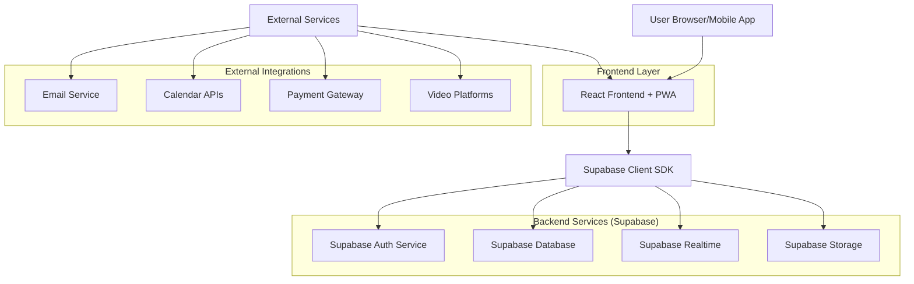
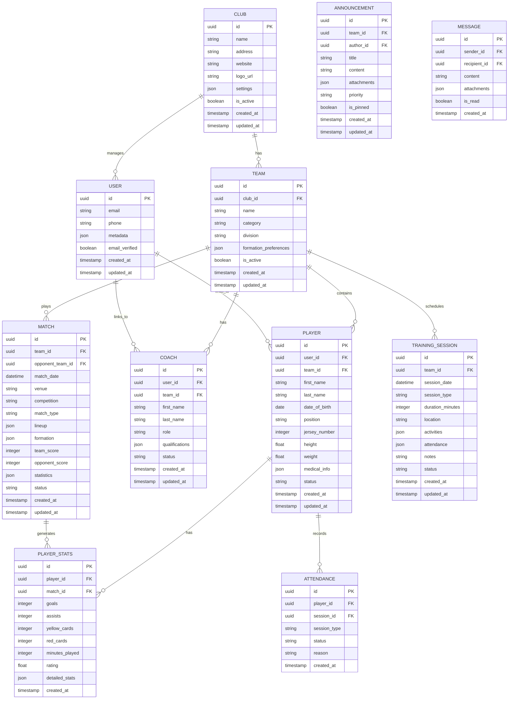
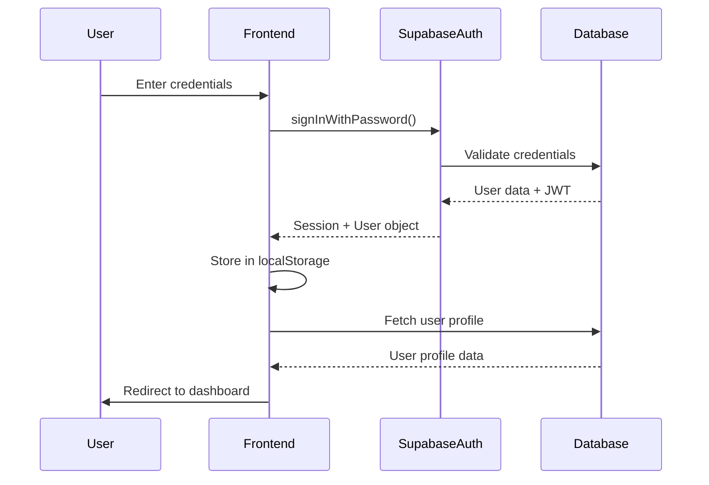
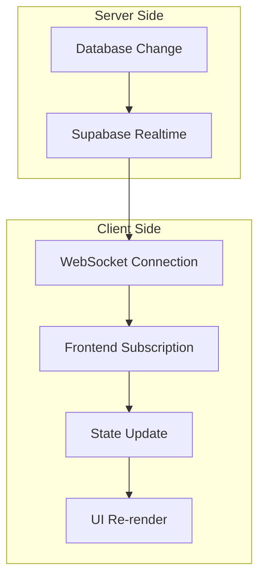
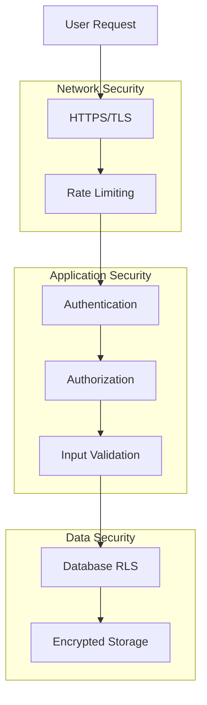
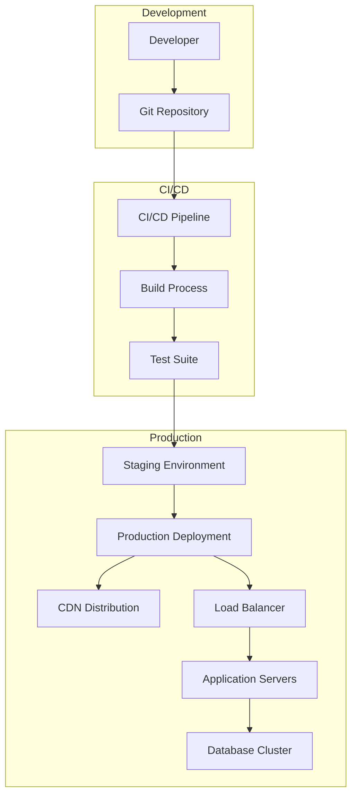
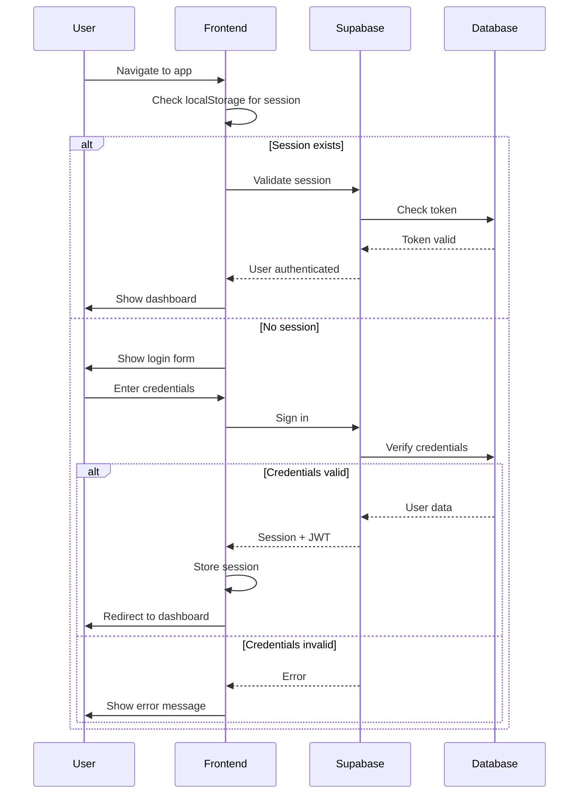
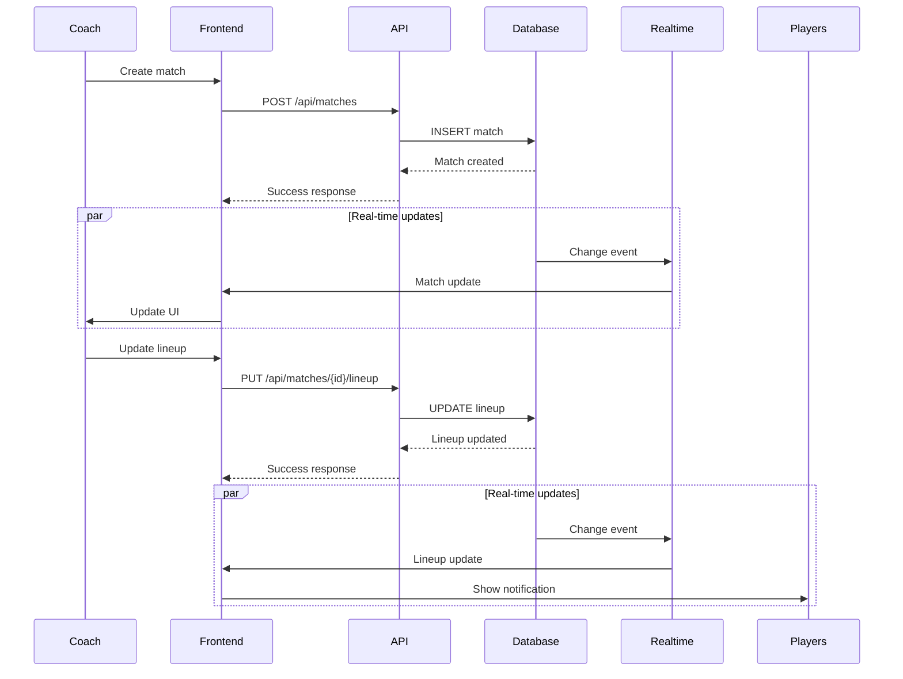
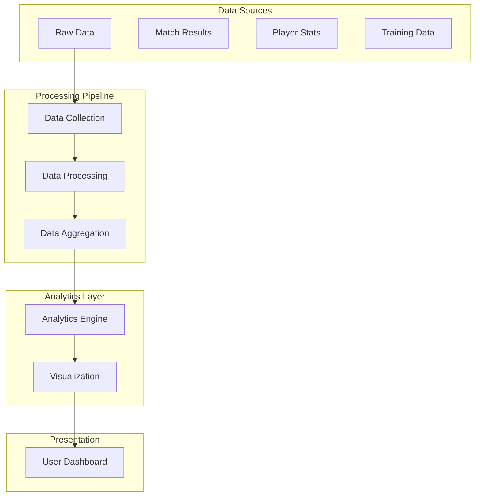

# Coachify Technical Architecture Document

## 1. System Architecture Overview

Coachify is built as a modern, scalable web application using a React + TypeScript frontend and Supabase backend-as-a-service platform. The architecture follows a microservices-inspired design with clear separation of concerns, real-time capabilities, and robust security measures.

### 1.1 High-Level Architecture



### 1.2 Architecture Principles
- **Security First**: All data is encrypted in transit and at rest
- **Real-time Updates**: WebSocket connections for live collaboration
- **Offline-First**: PWA capabilities for offline access
- **Scalable Design**: Horizontal scaling with Supabase infrastructure
- **Type Safety**: Full TypeScript implementation for reliability
- **Performance Optimized**: CDN, caching, and lazy loading strategies

## 2. Technology Stack Selection and Justification

### 2.1 Frontend Technology Stack

**React 18 + TypeScript**
- **Justification**: Industry-standard for building complex, interactive UIs with excellent ecosystem support
- **Benefits**: Component reusability, virtual DOM performance, extensive community

**Vite**
- **Justification**: Modern build tool with faster development and optimized production builds
- **Benefits**: Instant HMR, TypeScript support, optimized bundling

**Tailwind CSS**
- **Justification**: Utility-first CSS framework for rapid, consistent styling
- **Benefits**: Small bundle size, responsive design, customizable design system

**React Query (TanStack Query)**
- **Justification**: Powerful data synchronization and caching
- **Benefits**: Automatic background refetching, optimistic updates, offline support

**React Hook Form + Zod**
- **Justification**: Type-safe form handling with validation
- **Benefits**: Performance optimization, schema validation, TypeScript integration

**React Router v6**
- **Justification**: Declarative routing for single-page applications
- **Benefits**: Nested routing, code splitting, TypeScript support

### 2.2 Backend Technology Stack

**Supabase**
- **Justification**: Complete backend-as-a-service with built-in authentication, database, and real-time features
- **Benefits**: Zero server management, PostgreSQL reliability, real-time subscriptions

**PostgreSQL**
- **Justification**: Enterprise-grade relational database with advanced features
- **Benefits**: ACID compliance, complex queries, JSON support, full-text search

**Row Level Security (RLS)**
- **Justification**: Fine-grained access control at the database level
- **Benefits**: Security enforced at database level, role-based permissions

### 2.3 Additional Services

**PWA Configuration**
- Service Workers for offline functionality
- Web App Manifest for mobile installation
- Background sync for data updates

**CDN Integration**
- Static asset delivery optimization
- Global edge caching for improved performance
- SSL/TLS encryption for all communications

## 3. Database Design and Schema

### 3.1 Entity Relationship Diagram



### 3.2 Database Tables and Definitions

#### Core Tables

**clubs**
```sql
CREATE TABLE clubs (
    id UUID PRIMARY KEY DEFAULT gen_random_uuid(),
    name VARCHAR(255) NOT NULL,
    address TEXT,
    website VARCHAR(255),
    logo_url TEXT,
    settings JSONB DEFAULT '{}',
    is_active BOOLEAN DEFAULT true,
    created_at TIMESTAMP WITH TIME ZONE DEFAULT NOW(),
    updated_at TIMESTAMP WITH TIME ZONE DEFAULT NOW()
);
```

**teams**
```sql
CREATE TABLE teams (
    id UUID PRIMARY KEY DEFAULT gen_random_uuid(),
    club_id UUID REFERENCES clubs(id) ON DELETE CASCADE,
    name VARCHAR(255) NOT NULL,
    category VARCHAR(100) NOT NULL,
    division VARCHAR(100),
    formation_preferences JSONB DEFAULT '{}',
    is_active BOOLEAN DEFAULT true,
    created_at TIMESTAMP WITH TIME ZONE DEFAULT NOW(),
    updated_at TIMESTAMP WITH TIME ZONE DEFAULT NOW()
);
```

**players**
```sql
CREATE TABLE players (
    id UUID PRIMARY KEY DEFAULT gen_random_uuid(),
    user_id UUID REFERENCES auth.users(id) ON DELETE CASCADE,
    team_id UUID REFERENCES teams(id) ON DELETE CASCADE,
    first_name VARCHAR(100) NOT NULL,
    last_name VARCHAR(100) NOT NULL,
    date_of_birth DATE,
    position VARCHAR(50),
    jersey_number INTEGER,
    height DECIMAL(5,2),
    weight DECIMAL(5,2),
    medical_info JSONB DEFAULT '{}',
    status VARCHAR(20) DEFAULT 'active' CHECK (status IN ('active', 'injured', 'suspended', 'inactive')),
    created_at TIMESTAMP WITH TIME ZONE DEFAULT NOW(),
    updated_at TIMESTAMP WITH TIME ZONE DEFAULT NOW()
);
```

**matches**
```sql
CREATE TABLE matches (
    id UUID PRIMARY KEY DEFAULT gen_random_uuid(),
    team_id UUID REFERENCES teams(id) ON DELETE CASCADE,
    opponent_name VARCHAR(255) NOT NULL,
    match_date TIMESTAMP WITH TIME ZONE NOT NULL,
    venue VARCHAR(255),
    competition VARCHAR(100),
    match_type VARCHAR(50) DEFAULT 'league',
    lineup JSONB DEFAULT '{}',
    formation VARCHAR(20),
    team_score INTEGER DEFAULT 0,
    opponent_score INTEGER DEFAULT 0,
    statistics JSONB DEFAULT '{}',
    status VARCHAR(20) DEFAULT 'scheduled' CHECK (status IN ('scheduled', 'in_progress', 'completed', 'cancelled')),
    created_at TIMESTAMP WITH TIME ZONE DEFAULT NOW(),
    updated_at TIMESTAMP WITH TIME ZONE DEFAULT NOW()
);
```

### 3.3 Indexes and Performance Optimization

```sql
-- Performance indexes
CREATE INDEX idx_players_team_id ON players(team_id);
CREATE INDEX idx_players_user_id ON players(user_id);
CREATE INDEX idx_matches_team_id_date ON matches(team_id, match_date);
CREATE INDEX idx_matches_date ON matches(match_date);
CREATE INDEX idx_training_sessions_team_id ON training_sessions(team_id);
CREATE INDEX idx_training_sessions_date ON training_sessions(session_date);
CREATE INDEX idx_player_stats_player_id ON player_stats(player_id);
CREATE INDEX idx_player_stats_match_id ON player_stats(match_id);
CREATE INDEX idx_attendance_player_id ON attendance(player_id);
CREATE INDEX idx_attendance_session_id ON attendance(session_id);

-- Full-text search indexes
CREATE INDEX idx_players_name ON players USING gin(to_tsvector('english', first_name || ' ' || last_name));
CREATE INDEX idx_teams_name ON teams USING gin(to_tsvector('english', name));
```

## 4. API Design and Endpoints

### 4.1 Authentication API

#### User Registration
```
POST /api/auth/register
```

**Request Body:**
```typescript
interface RegisterRequest {
  email: string;
  password: string;
  role: 'coach' | 'player' | 'president';
  firstName: string;
  lastName: string;
  phone?: string;
  teamCode?: string; // For joining existing team
}
```

**Response:**
```typescript
interface RegisterResponse {
  user: User;
  session: Session;
  message: string;
}
```

#### User Login
```
POST /api/auth/login
```

**Request Body:**
```typescript
interface LoginRequest {
  email: string;
  password: string;
}
```

### 4.2 Team Management API

#### Get Team Details
```
GET /api/teams/:teamId
```

**Response:**
```typescript
interface TeamDetails {
  id: string;
  name: string;
  clubId: string;
  category: string;
  division: string;
  formationPreferences: Formation;
  players: Player[];
  coaches: Coach[];
  statistics: TeamStatistics;
}
```

#### Update Team Formation
```
PUT /api/teams/:teamId/formation
```

**Request Body:**
```typescript
interface UpdateFormationRequest {
  formation: string; // e.g., "4-3-3", "4-4-2"
  tactics: {
    attacking: string;
    defensive: string;
    pressing: string;
  };
}
```

### 4.3 Player Management API

#### Get Player Profile
```
GET /api/players/:playerId
```

**Response:**
```typescript
interface PlayerProfile {
  id: string;
  userId: string;
  firstName: string;
  lastName: string;
  dateOfBirth: string;
  position: string;
  jerseyNumber: number;
  height: number;
  weight: number;
  statistics: PlayerStatistics;
  availability: AvailabilityStatus;
  medicalInfo: MedicalInfo;
}
```

#### Update Player Statistics
```
POST /api/players/:playerId/statistics
```

**Request Body:**
```typescript
interface PlayerStatisticsUpdate {
  matchId: string;
  goals: number;
  assists: number;
  minutesPlayed: number;
  rating: number;
  detailedStats: {
    passes: number;
    passAccuracy: number;
    tackles: number;
    interceptions: number;
  };
}
```

### 4.4 Schedule Management API

#### Create Training Session
```
POST /api/teams/:teamId/training-sessions
```

**Request Body:**
```typescript
interface CreateTrainingSession {
  sessionDate: string;
  durationMinutes: number;
  sessionType: 'tactical' | 'technical' | 'physical' | 'mixed';
  location: string;
  activities: TrainingActivity[];
  notes: string;
}
```

#### Update Match Schedule
```
PUT /api/matches/:matchId
```

**Request Body:**
```typescript
interface UpdateMatchSchedule {
  matchDate: string;
  venue: string;
  opponentName: string;
  competition: string;
  lineup?: PlayerLineup;
}
```

### 4.5 Communication API

#### Send Team Announcement
```
POST /api/teams/:teamId/announcements
```

**Request Body:**
```typescript
interface CreateAnnouncement {
  title: string;
  content: string;
  priority: 'low' | 'medium' | 'high' | 'urgent';
  attachments: string[];
  targetAudience: 'all' | 'players' | 'coaches' | 'specific';
}
```

#### Send Direct Message
```
POST /api/messages
```

**Request Body:**
```typescript
interface SendMessage {
  recipientId: string;
  content: string;
  attachments?: string[];
}
```

### 4.6 Analytics API

#### Get Team Analytics
```
GET /api/teams/:teamId/analytics
```

**Query Parameters:**
- `period`: 'week' | 'month' | 'season' | 'custom'
- `startDate`: ISO date string
- `endDate`: ISO date string

**Response:**
```typescript
interface TeamAnalytics {
  performance: {
    wins: number;
    draws: number;
    losses: number;
    goalsFor: number;
    goalsAgainst: number;
    winPercentage: number;
  };
  playerStats: {
    topScorers: PlayerStats[];
    mostAssists: PlayerStats[];
    attendance: AttendanceStats;
  };
  trends: PerformanceTrend[];
}
```

## 5. Frontend Architecture and Component Structure

### 5.1 Project Structure

```
src/
├── components/
│   ├── common/
│   │   ├── Button/
│   │   ├── Input/
│   │   ├── Card/
│   │   ├── Modal/
│   │   └── LoadingSpinner/
│   ├── layout/
│   │   ├── Header/
│   │   ├── Sidebar/
│   │   ├── Footer/
│   │   └── DashboardLayout/
│   ├── auth/
│   │   ├── LoginForm/
│   │   ├── RegisterForm/
│   │   └── ProtectedRoute/
│   ├── dashboard/
│   │   ├── CoachDashboard/
│   │   ├── PlayerDashboard/
│   │   └── PresidentDashboard/
│   ├── team/
│   │   ├── TeamRoster/
│   │   ├── PlayerCard/
│   │   ├── PlayerProfile/
│   │   └── LineupBuilder/
│   ├── schedule/
│   │   ├── Calendar/
│   │   ├── MatchCard/
│   │   ├── TrainingSession/
│   │   └── AvailabilityTracker/
│   ├── analytics/
│   │   ├── StatsChart/
│   │   ├── PerformanceMetrics/
│   │   └── TrendAnalysis/
│   └── communication/
│       ├── AnnouncementList/
│       ├── MessageCenter/
│       └── NotificationBell/
├── hooks/
│   ├── useAuth.ts
│   ├── useTeam.ts
│   ├── usePlayer.ts
│   ├── useSchedule.ts
│   ├── useAnalytics.ts
│   └── useRealtime.ts
├── services/
│   ├── api/
│   │   ├── auth.service.ts
│   │   ├── team.service.ts
│   │   ├── player.service.ts
│   │   ├── schedule.service.ts
│   │   └── analytics.service.ts
│   ├── supabase/
│   │   ├── client.ts
│   │   ├── auth.ts
│   │   └── realtime.ts
│   └── utils/
│       ├── validators.ts
│       ├── formatters.ts
│       └── constants.ts
├── store/
│   ├── auth.store.ts
│   ├── team.store.ts
│   └── ui.store.ts
├── types/
│   ├── user.types.ts
│   ├── team.types.ts
│   ├── player.types.ts
│   └── api.types.ts
├── pages/
│   ├── Login/
│   ├── Dashboard/
│   ├── Team/
│   ├── Schedule/
│   ├── Analytics/
│   └── Settings/
├── styles/
│   ├── globals.css
│   └── tailwind.css
└── App.tsx
```

### 5.2 Component Architecture Patterns

#### Higher-Order Components (HOCs)
```typescript
// withAuth.tsx
export function withAuth<P extends object>(
  Component: ComponentType<P>
) {
  return function AuthenticatedComponent(props: P) {
    const { user, isLoading } = useAuth();
    
    if (isLoading) {
      return <LoadingSpinner />;
    }
    
    if (!user) {
      return <Navigate to="/login" replace />;
    }
    
    return <Component {...props} />;
  };
}
```

#### Custom Hooks
```typescript
// useTeam.ts
export function useTeam(teamId: string) {
  const { data, error, isLoading, mutate } = useSWR(
    teamId ? `/api/teams/${teamId}` : null,
    fetcher
  );
  
  const updateTeam = useCallback(async (updates: Partial<Team>) => {
    const response = await teamService.updateTeam(teamId, updates);
    mutate(response.data);
  }, [teamId, mutate]);
  
  return {
    team: data,
    error,
    isLoading,
    updateTeam,
  };
}
```

#### Compound Components
```typescript
// TeamCard.tsx
export function TeamCard({ team, children }: TeamCardProps) {
  return (
    <Card className="team-card">
      <CardHeader>
        <TeamCard.Title team={team} />
        <TeamCard.Actions team={team} />
      </CardHeader>
      <CardContent>
        {children}
      </CardContent>
    </Card>
  );
}

TeamCard.Title = function TeamCardTitle({ team }: { team: Team }) {
  return <h3 className="text-lg font-semibold">{team.name}</h3>;
};
```

### 5.3 State Management Architecture

#### Global State (Zustand)
```typescript
// team.store.ts
interface TeamState {
  currentTeam: Team | null;
  teams: Team[];
  setCurrentTeam: (team: Team) => void;
  addTeam: (team: Team) => void;
  updateTeam: (teamId: string, updates: Partial<Team>) => void;
}

export const useTeamStore = create<TeamState>((set) => ({
  currentTeam: null,
  teams: [],
  setCurrentTeam: (team) => set({ currentTeam: team }),
  addTeam: (team) => set((state) => ({ teams: [...state.teams, team] })),
  updateTeam: (teamId, updates) =>
    set((state) => ({
      teams: state.teams.map((team) =>
        team.id === teamId ? { ...team, ...updates } : team
      ),
      currentTeam:
        state.currentTeam?.id === teamId
          ? { ...state.currentTeam, ...updates }
          : state.currentTeam,
    })),
}));
```

#### Server State (React Query)
```typescript
// queries.ts
export const teamQueries = {
  all: () => ['teams'] as const,
  lists: () => [...teamQueries.all(), 'list'] as const,
  list: (filters: TeamFilters) =>
    [...teamQueries.lists(), filters] as const,
  details: () => [...teamQueries.all(), 'detail'] as const,
  detail: (id: string) => [...teamQueries.details(), id] as const,
};

export const useTeamQuery = (teamId: string) => {
  return useQuery({
    queryKey: teamQueries.detail(teamId),
    queryFn: () => teamService.getTeam(teamId),
    staleTime: 5 * 60 * 1000, // 5 minutes
    cacheTime: 10 * 60 * 1000, // 10 minutes
  });
};
```

## 6. Authentication and Authorization System

### 6.1 Authentication Flow



### 6.2 Role-Based Access Control (RBAC)

#### User Roles and Permissions

| Role | Database Access | API Permissions | Frontend Routes |
|------|----------------|-----------------|-----------------|
| **President** | All club data | Full CRUD | All routes |
| **Coach** | Team-specific data | Team CRUD | Team management |
| **Player** | Personal + team readonly | Read-only | Dashboard, profile |
| **Assistant** | Limited team data | Limited CRUD | Team assistance |

#### Row Level Security Policies

```sql
-- Players can only read their own data
CREATE POLICY "Players can view own profile" ON players
    FOR SELECT USING (auth.uid() = user_id);

-- Coaches can manage their team players
CREATE POLICY "Coaches can manage team players" ON players
    FOR ALL USING (
        EXISTS (
            SELECT 1 FROM coaches
            WHERE coaches.user_id = auth.uid()
            AND coaches.team_id = players.team_id
            AND coaches.role IN ('head_coach', 'assistant_coach')
        )
    );

-- Presidents can manage all club data
CREATE POLICY "Presidents can manage club data" ON teams
    FOR ALL USING (
        EXISTS (
            SELECT 1 FROM clubs
            JOIN users ON users.club_id = clubs.id
            WHERE users.id = auth.uid()
            AND users.role = 'president'
            AND teams.club_id = clubs.id
        )
    );
```

### 6.3 JWT Token Management

```typescript
// auth.service.ts
export class AuthService {
  private supabase: SupabaseClient;
  
  async refreshSession() {
    const { data, error } = await this.supabase.auth.refreshSession();
    
    if (error) {
      throw new AuthError('Failed to refresh session');
    }
    
    // Update stored session
    localStorage.setItem('session', JSON.stringify(data.session));
    
    return data.session;
  }
  
  async validateToken(token: string): Promise<boolean> {
    try {
      const { data, error } = await this.supabase.auth.getUser(token);
      return !error && !!data.user;
    } catch {
      return false;
    }
  }
}
```

### 6.4 Multi-Factor Authentication (MFA)

```typescript
// mfa.service.ts
export class MFAService {
  async enableMFA(userId: string) {
    const { data, error } = await this.supabase.auth.mfa.enroll({
      factorType: 'totp',
      friendlyName: 'Authenticator App',
    });
    
    if (error) throw error;
    
    return {
      qrCode: data.totp.qr_code,
      secret: data.totp.secret,
      factorId: data.id,
    };
  }
  
  async verifyMFA(factorId: string, code: string) {
    const { data, error } = await this.supabase.auth.mfa.challenge({
      factorId,
    });
    
    if (error) throw error;
    
    const { data: verifyData, error: verifyError } = 
      await this.supabase.auth.mfa.verify({
        factorId,
        challengeId: data.id,
        code,
      });
    
    if (verifyError) throw verifyError;
    
    return verifyData;
  }
}
```

## 7. Real-time Features Architecture

### 7.1 Real-time Data Flow



### 7.2 Real-time Subscriptions

```typescript
// realtime.service.ts
export class RealtimeService {
  private subscriptions: Map<string, RealtimeChannel> = new Map();
  
  subscribeToTeamUpdates(teamId: string, callback: (payload: any) => void) {
    const channel = supabase
      .channel(`team:${teamId}`)
      .on(
        'postgres_changes',
        {
          event: '*',
          schema: 'public',
          table: 'players',
          filter: `team_id=eq.${teamId}`,
        },
        callback
      )
      .subscribe();
    
    this.subscriptions.set(`team:${teamId}`, channel);
    
    return () => {
      supabase.removeChannel(channel);
      this.subscriptions.delete(`team:${teamId}`);
    };
  }
  
  subscribeToMatchUpdates(matchId: string, callback: (payload: any) => void) {
    const channel = supabase
      .channel(`match:${matchId}`)
      .on(
        'postgres_changes',
        {
          event: '*',
          schema: 'public',
          table: 'player_stats',
          filter: `match_id=eq.${matchId}`,
        },
        callback
      )
      .subscribe();
    
    return () => supabase.removeChannel(channel);
  }
}
```

### 7.3 Real-time Features Implementation

#### Live Match Updates
```typescript
// useLiveMatch.ts
export function useLiveMatch(matchId: string) {
  const [matchData, setMatchData] = useState<Match | null>(null);
  const [playerStats, setPlayerStats] = useState<PlayerStats[]>([]);
  
  useEffect(() => {
    // Initial data fetch
    fetchMatchData(matchId).then(setMatchData);
    fetchPlayerStats(matchId).then(setPlayerStats);
    
    // Real-time subscriptions
    const unsubscribeMatch = realtimeService.subscribeToMatchUpdates(
      matchId,
      (payload) => {
        if (payload.eventType === 'UPDATE') {
          setMatchData(payload.new);
        }
      }
    );
    
    const unsubscribeStats = realtimeService.subscribeToPlayerStats(
      matchId,
      (payload) => {
        if (payload.eventType === 'INSERT') {
          setPlayerStats((prev) => [...prev, payload.new]);
        } else if (payload.eventType === 'UPDATE') {
          setPlayerStats((prev) =>
            prev.map((stat) =>
              stat.id === payload.new.id ? payload.new : stat
            )
          );
        }
      }
    );
    
    return () => {
      unsubscribeMatch();
      unsubscribeStats();
    };
  }, [matchId]);
  
  return { matchData, playerStats };
}
```

#### Live Team Chat
```typescript
// useTeamChat.ts
export function useTeamChat(teamId: string) {
  const [messages, setMessages] = useState<Message[]>([]);
  
  useEffect(() => {
    // Fetch initial messages
    fetchTeamMessages(teamId).then(setMessages);
    
    // Subscribe to new messages
    const unsubscribe = realtimeService.subscribeToTeamMessages(
      teamId,
      (payload) => {
        if (payload.eventType === 'INSERT') {
          setMessages((prev) => [...prev, payload.new]);
        }
      }
    );
    
    return unsubscribe;
  }, [teamId]);
  
  const sendMessage = useCallback(
    async (content: string) => {
      await messageService.sendTeamMessage(teamId, content);
    },
    [teamId]
  );
  
  return { messages, sendMessage };
}
```

## 8. Security Architecture

### 8.1 Security Layers



### 8.2 Security Measures

#### Input Validation and Sanitization
```typescript
// validation.service.ts
export class ValidationService {
  static sanitizeInput(input: string): string {
    return DOMPurify.sanitize(input, {
      ALLOWED_TAGS: ['b', 'i', 'em', 'strong'],
      ALLOWED_ATTR: [],
    });
  }
  
  static validateEmail(email: string): boolean {
    const emailRegex = /^[^\s@]+@[^\s@]+\.[^\s@]+$/;
    return emailRegex.test(email);
  }
  
  static validatePhoneNumber(phone: string): boolean {
    const phoneRegex = /^\+?[1-9]\d{1,14}$/;
    return phoneRegex.test(phone);
  }
  
  static validateFileUpload(file: File): boolean {
    const allowedTypes = ['image/jpeg', 'image/png', 'image/gif', 'application/pdf'];
    const maxSize = 5 * 1024 * 1024; // 5MB
    
    return allowedTypes.includes(file.type) && file.size <= maxSize;
  }
}
```

#### API Security
```typescript
// security.middleware.ts
export class SecurityMiddleware {
  static rateLimit = rateLimit({
    windowMs: 15 * 60 * 1000, // 15 minutes
    max: 100, // limit each IP to 100 requests per windowMs
    message: 'Too many requests from this IP',
    standardHeaders: true,
    legacyHeaders: false,
  });
  
  static helmet = helmet({
    contentSecurityPolicy: {
      directives: {
        defaultSrc: ["'self'"],
        styleSrc: ["'self'", "'unsafe-inline'"],
        scriptSrc: ["'self'"],
        imgSrc: ["'self'", "data:", "https:"],
        connectSrc: ["'self'", process.env.SUPABASE_URL],
      },
    },
  });
  
  static cors = cors({
    origin: process.env.FRONTEND_URL,
    credentials: true,
    methods: ['GET', 'POST', 'PUT', 'DELETE', 'OPTIONS'],
    allowedHeaders: ['Content-Type', 'Authorization'],
  });
}
```

#### Data Encryption
```typescript
// encryption.service.ts
export class EncryptionService {
  private static algorithm = 'aes-256-gcm';
  
  static encrypt(text: string, key: string): EncryptedData {
    const iv = crypto.randomBytes(16);
    const cipher = crypto.createCipher(this.algorithm, key);
    
    let encrypted = cipher.update(text, 'utf8', 'hex');
    encrypted += cipher.final('hex');
    
    const authTag = cipher.getAuthTag();
    
    return {
      encrypted,
      iv: iv.toString('hex'),
      authTag: authTag.toString('hex'),
    };
  }
  
  static decrypt(encryptedData: EncryptedData, key: string): string {
    const decipher = crypto.createDecipher(this.algorithm, key);
    decipher.setAuthTag(Buffer.from(encryptedData.authTag, 'hex'));
    
    let decrypted = decipher.update(encryptedData.encrypted, 'hex', 'utf8');
    decrypted += decipher.final('utf8');
    
    return decrypted;
  }
}
```

### 8.3 Security Monitoring

```typescript
// security.monitor.ts
export class SecurityMonitor {
  static logSecurityEvent(event: SecurityEvent) {
    const logEntry = {
      timestamp: new Date().toISOString(),
      eventType: event.type,
      userId: event.userId,
      ipAddress: event.ipAddress,
      userAgent: event.userAgent,
      details: event.details,
    };
    
    // Log to security monitoring service
    logger.warn('Security event', logEntry);
    
    // Alert for critical events
    if (event.severity === 'critical') {
      this.sendSecurityAlert(logEntry);
    }
  }
  
  static detectSuspiciousActivity(userId: string, activity: ActivityLog) {
    const patterns = [
      this.detectBruteForce(userId, activity),
      this.detectUnusualLocation(userId, activity),
      this.detectDataExfiltration(userId, activity),
    ];
    
    patterns.forEach((pattern) => {
      if (pattern.isSuspicious) {
        this.logSecurityEvent({
          type: pattern.type,
          userId,
          severity: 'high',
          details: pattern.details,
        });
      }
    });
  }
}
```

## 9. Performance and Scalability Design

### 9.1 Performance Optimization Strategies

#### Frontend Optimization
```typescript
// performance.optimization.ts
export class FrontendOptimization {
  // Code splitting
  static routes = [
    {
      path: '/dashboard',
      component: lazy(() => import('./pages/Dashboard')),
    },
    {
      path: '/team/*',
      component: lazy(() => import('./pages/Team')),
    },
    {
      path: '/analytics',
      component: lazy(() => import('./pages/Analytics')),
    },
  ];
  
  // Image optimization
  static optimizeImage(src: string, size: number): string {
    return `${src}?width=${size}&height=${size}&quality=80&format=webp`;
  }
  
  // Virtual scrolling for large lists
  static VirtualizedList = ({ items, itemHeight, renderItem }) => {
    return (
      <FixedSizeList
        height={600}
        itemCount={items.length}
        itemSize={itemHeight}
        width="100%"
      >
        {({ index, style }) => (
          <div style={style}>
            {renderItem(items[index])}
          </div>
        )}
      </FixedSizeList>
    );
  };
}
```

#### Backend Optimization
```typescript
// cache.service.ts
export class CacheService {
  private cache = new Map<string, CacheEntry>();
  
  async get<T>(key: string): Promise<T | null> {
    const entry = this.cache.get(key);
    
    if (!entry) return null;
    
    if (Date.now() > entry.expiresAt) {
      this.cache.delete(key);
      return null;
    }
    
    return entry.data;
  }
  
  async set<T>(key: string, data: T, ttl: number = 300): Promise<void> {
    this.cache.set(key, {
      data,
      expiresAt: Date.now() + ttl * 1000,
    });
  }
  
  async invalidate(pattern: string): Promise<void> {
    const regex = new RegExp(pattern);
    
    for (const key of this.cache.keys()) {
      if (regex.test(key)) {
        this.cache.delete(key);
      }
    }
  }
}
```

### 9.2 Database Performance

#### Query Optimization
```sql
-- Optimized query with proper indexing
CREATE INDEX CONCURRENTLY idx_matches_team_date 
ON matches (team_id, match_date DESC) 
WHERE status = 'completed';

-- Materialized view for analytics
CREATE MATERIALIZED VIEW team_performance_summary AS
SELECT 
    t.id as team_id,
    t.name as team_name,
    COUNT(CASE WHEN m.team_score > m.opponent_score THEN 1 END) as wins,
    COUNT(CASE WHEN m.team_score = m.opponent_score THEN 1 END) as draws,
    COUNT(CASE WHEN m.team_score < m.opponent_score THEN 1 END) as losses,
    AVG(m.team_score) as avg_goals_for,
    AVG(m.opponent_score) as avg_goals_against
FROM teams t
LEFT JOIN matches m ON t.id = m.team_id
WHERE m.status = 'completed'
    AND m.match_date >= CURRENT_DATE - INTERVAL '1 year'
GROUP BY t.id, t.name;

-- Refresh materialized view periodically
CREATE OR REPLACE FUNCTION refresh_team_performance()
RETURNS void AS $$
BEGIN
    REFRESH MATERIALIZED VIEW CONCURRENTLY team_performance_summary;
END;
$$ LANGUAGE plpgsql;
```

### 9.3 Scalability Architecture

#### Horizontal Scaling Design
```typescript
// scaling.service.ts
export class ScalingService {
  // Database connection pooling
  static createConnectionPool() {
    return new Pool({
      host: process.env.DB_HOST,
      port: parseInt(process.env.DB_PORT || '5432'),
      database: process.env.DB_NAME,
      user: process.env.DB_USER,
      password: process.env.DB_PASSWORD,
      max: 20, // Maximum number of clients in the pool
      idleTimeoutMillis: 30000,
      connectionTimeoutMillis: 2000,
    });
  }
  
  // Load balancing for API requests
  static getAPIEndpoint(): string {
    const endpoints = process.env.API_ENDPOINTS?.split(',') || [];
    const randomIndex = Math.floor(Math.random() * endpoints.length);
    return endpoints[randomIndex];
  }
  
  // CDN integration for static assets
  static getAssetUrl(path: string): string {
    const cdnUrl = process.env.CDN_URL;
    return `${cdnUrl}/${path}`;
  }
}
```

## 10. Deployment and Infrastructure Architecture

### 10.1 Deployment Architecture



### 10.2 Environment Configuration

#### Environment Variables
```bash
# .env.production
VITE_SUPABASE_URL=https://your-project.supabase.co
VITE_SUPABASE_ANON_KEY=your-anon-key
VITE_API_URL=https://api.coachify.app
VITE_CDN_URL=https://cdn.coachify.app
VITE_ENVIRONMENT=production
VITE_SENTRY_DSN=https://your-sentry-dsn
VITE_GOOGLE_ANALYTICS_ID=GA-XXXXXXXXX
```

#### Docker Configuration
```dockerfile
# Dockerfile
FROM node:18-alpine as builder

WORKDIR /app
COPY package*.json ./
RUN npm ci --only=production

COPY . .
RUN npm run build

FROM nginx:alpine
COPY --from=builder /app/dist /usr/share/nginx/html
COPY nginx.conf /etc/nginx/nginx.conf

EXPOSE 80
CMD ["nginx", "-g", "daemon off;"]
```

### 10.3 CI/CD Pipeline

```yaml
# .github/workflows/deploy.yml
name: Deploy to Production

on:
  push:
    branches: [main]

jobs:
  test:
    runs-on: ubuntu-latest
    steps:
      - uses: actions/checkout@v3
      - uses: actions/setup-node@v3
        with:
          node-version: '18'
      - run: npm ci
      - run: npm run test:unit
      - run: npm run test:integration
      - run: npm run test:e2e

  build:
    needs: test
    runs-on: ubuntu-latest
    steps:
      - uses: actions/checkout@v3
      - uses: actions/setup-node@v3
        with:
          node-version: '18'
      - run: npm ci
      - run: npm run build
      - run: npm run lint
      - run: npm run type-check

  deploy:
    needs: build
    runs-on: ubuntu-latest
    steps:
      - name: Deploy to Supabase
        run: |
          supabase db push
          supabase functions deploy
      - name: Deploy to CDN
        run: |
          aws s3 sync dist/ s3://coachify-cdn
          aws cloudfront create-invalidation --distribution-id ${{ secrets.CF_DISTRIBUTION_ID }} --paths "/*"
```

## 11. Integration Architecture

### 11.1 Third-Party Integrations

#### Calendar Integration
```typescript
// calendar.integration.ts
export class CalendarIntegration {
  private googleCalendar: calendar_v3.Calendar;
  private outlookCalendar: any;
  
  async syncMatchToCalendar(
    match: Match,
    calendarType: 'google' | 'outlook' | 'apple'
  ) {
    const event = {
      summary: `Match: ${match.teamName} vs ${match.opponentName}`,
      description: `Competition: ${match.competition}\nVenue: ${match.venue}`,
      start: {
        dateTime: match.matchDate,
        timeZone: 'UTC',
      },
      end: {
        dateTime: new Date(new Date(match.matchDate).getTime() + 2 * 60 * 60 * 1000),
        timeZone: 'UTC',
      },
      attendees: match.players.map((player) => ({
        email: player.email,
        displayName: `${player.firstName} ${player.lastName}`,
      })),
    };
    
    switch (calendarType) {
      case 'google':
        return await this.createGoogleCalendarEvent(event);
      case 'outlook':
        return await this.createOutlookEvent(event);
      case 'apple':
        return await this.createAppleEvent(event);
    }
  }
}
```

#### Payment Integration
```typescript
// payment.integration.ts
export class PaymentIntegration {
  private stripe: Stripe;
  
  constructor() {
    this.stripe = new Stripe(process.env.STRIPE_SECRET_KEY!, {
      apiVersion: '2023-10-16',
    });
  }
  
  async createSubscription(
    teamId: string,
    plan: 'pro' | 'elite',
    customerEmail: string
  ) {
    const priceId = plan === 'pro' 
      ? process.env.STRIPE_PRO_PRICE_ID 
      : process.env.STRIPE_ELITE_PRICE_ID;
    
    const session = await this.stripe.checkout.sessions.create({
      payment_method_types: ['card'],
      line_items: [
        {
          price: priceId,
          quantity: 1,
        },
      ],
      mode: 'subscription',
      success_url: `${process.env.FRONTEND_URL}/payment/success?session_id={CHECKOUT_SESSION_ID}`,
      cancel_url: `${process.env.FRONTEND_URL}/payment/cancel`,
      customer_email: customerEmail,
      metadata: {
        teamId,
        plan,
      },
    });
    
    return session;
  }
  
  async handleWebhook(payload: any, signature: string) {
    const event = this.stripe.webhooks.constructEvent(
      payload,
      signature,
      process.env.STRIPE_WEBHOOK_SECRET!
    );
    
    switch (event.type) {
      case 'checkout.session.completed':
        await this.activateSubscription(event.data.object);
        break;
      case 'customer.subscription.deleted':
        await this.deactivateSubscription(event.data.object);
        break;
    }
  }
}
```

### 11.2 API Gateway Configuration

```typescript
// gateway.config.ts
export const apiGatewayConfig = {
  routes: [
    {
      path: '/api/auth/*',
      target: process.env.AUTH_SERVICE_URL,
      rateLimit: {
        windowMs: 15 * 60 * 1000,
        max: 10,
      },
    },
    {
      path: '/api/teams/*',
      target: process.env.TEAM_SERVICE_URL,
      authentication: true,
      authorization: ['coach', 'president'],
    },
    {
      path: '/api/analytics/*',
      target: process.env.ANALYTICS_SERVICE_URL,
      authentication: true,
      cache: {
        ttl: 300, // 5 minutes
      },
    },
  ],
  
  middleware: [
    cors(),
    helmet(),
    compression(),
    rateLimit(),
  ],
};
```

## 12. Data Flow Diagrams

### 12.1 User Authentication Flow



### 12.2 Match Data Flow



### 12.3 Analytics Data Flow



## 13. Error Handling and Logging Strategy

### 13.1 Error Handling Architecture

```typescript
// error.handler.ts
export class ErrorHandler {
  static handleError(error: Error, context: ErrorContext): void {
    const errorEntry = {
      timestamp: new Date().toISOString(),
      message: error.message,
      stack: error.stack,
      context,
      severity: this.determineSeverity(error),
      userId: context.userId,
      sessionId: context.sessionId,
    };
    
    // Log to different destinations based on severity
    switch (errorEntry.severity) {
      case 'critical':
        logger.critical('Critical error occurred', errorEntry);
        this.notifyDevelopers(errorEntry);
        break;
      case 'error':
        logger.error('Error occurred', errorEntry);
        break;
      case 'warning':
        logger.warn('Warning occurred', errorEntry);
        break;
      default:
        logger.info('Info message', errorEntry);
    }
    
    // Send to error tracking service
    Sentry.captureException(error, {
      tags: {
        userId: context.userId,
        teamId: context.teamId,
      },
      extra: context,
    });
  }
  
  static determineSeverity(error: Error): ErrorSeverity {
    if (error instanceof DatabaseError) {
      return 'critical';
    } else if (error instanceof AuthenticationError) {
      return 'error';
    } else if (error instanceof ValidationError) {
      return 'warning';
    }
    return 'info';
  }
}
```

### 13.2 Frontend Error Boundary

```typescript
// ErrorBoundary.tsx
export class ErrorBoundary extends React.Component<
  Props,
  State
> {
  static getDerivedStateFromError(error: Error): State {
    return { hasError: true, error };
  }
  
  componentDidCatch(error: Error, errorInfo: ErrorInfo) {
    errorHandler.handleError(error, {
      component: this.props.componentName,
      errorInfo: errorInfo.componentStack,
      userId: this.props.userId,
    });
  }
  
  render() {
    if (this.state.hasError) {
      return (
        <div className="error-fallback">
          <h2>Something went wrong</h2>
          <p>We've been notified and are working on a fix.</p>
          <button onClick={() => this.setState({ hasError: false })}>
            Try again
          </button>
        </div>
      );
    }
    
    return this.props.children;
  }
}
```

### 13.3 Logging Strategy

```typescript
// logger.service.ts
export class LoggerService {
  private transports: Transport[] = [
    new ConsoleTransport(),
    new FileTransport({
      filename: 'logs/error.log',
      level: 'error',
    }),
    new FileTransport({
      filename: 'logs/combined.log',
    }),
    new SupabaseTransport({
      table: 'system_logs',
    }),
  ];
  
  log(level: LogLevel, message: string, meta?: any) {
    const logEntry = {
      timestamp: new Date().toISOString(),
      level,
      message,
      meta,
      service: 'coachify',
      environment: process.env.NODE_ENV,
    };
    
    this.transports.forEach((transport) => {
      transport.log(logEntry);
    });
  }
  
  // Structured logging for different scenarios
  logUserAction(userId: string, action: string, data: any) {
    this.log('info', `User action: ${action}`, {
      userId,
      action,
      data,
      category: 'user_action',
    });
  }
  
  logAPIRequest(method: string, path: string, duration: number, status: number) {
    this.log('info', `API Request: ${method} ${path}`, {
      method,
      path,
      duration,
      status,
      category: 'api_request',
    });
  }
  
  logDatabaseQuery(query: string, duration: number, rows: number) {
    this.log('debug', `Database query executed`, {
      query: this.sanitizeQuery(query),
      duration,
      rows,
      category: 'database_query',
    });
  }
  
  private sanitizeQuery(query: string): string {
    // Remove sensitive data from queries
    return query.replace(/'[^']*'/g, '?');
  }
}
```

## 14. Testing Architecture

### 14.1 Testing Strategy Overview

```
testing/
├── unit/
│   ├── components/
│   │   ├── Button.test.tsx
│   │   ├── Card.test.tsx
│   │   └── Modal.test.tsx
│   ├── services/
│   │   ├── auth.service.test.ts
│   │   ├── team.service.test.ts
│   │   └── api.service.test.ts
│   └── utils/
│       ├── validators.test.ts
│       └── formatters.test.ts
├── integration/
│   ├── api/
│   │   ├── auth.integration.test.ts
│   │   ├── teams.integration.test.ts
│   │   └── players.integration.test.ts
│   └── database/
│       ├── migrations.test.ts
│       └── relationships.test.ts
├── e2e/
│   ├── auth/
│   │   ├── login.spec.ts
│   │   └── registration.spec.ts
│   ├── team-management/
│   │   ├── create-team.spec.ts
│   │   └── manage-players.spec.ts
│   └── schedule/
│       ├── create-match.spec.ts
│       └── update-lineup.spec.ts
└── performance/
    ├── load/
    │   ├── concurrent-users.test.ts
    │   └── api-response-time.test.ts
    └── stress/
        ├── database-connections.test.ts
        └── memory-usage.test.ts
```

### 14.2 Unit Testing

```typescript
// Button.test.tsx
import { render, screen, fireEvent } from '@testing-library/react';
import { Button } from './Button';

describe('Button Component', () => {
  it('renders with correct text', () => {
    render(<Button>Click me</Button>);
    expect(screen.getByText('Click me')).toBeInTheDocument();
  });
  
  it('calls onClick handler when clicked', () => {
    const handleClick = jest.fn();
    render(<Button onClick={handleClick}>Click me</Button>);
    
    fireEvent.click(screen.getByText('Click me'));
    expect(handleClick).toHaveBeenCalledTimes(1);
  });
  
  it('disables button when loading', () => {
    render(<Button loading>Click me</Button>);
    expect(screen.getByText('Click me')).toBeDisabled();
  });
  
  it('shows loading spinner when loading', () => {
    render(<Button loading>Click me</Button>);
    expect(screen.getByTestId('loading-spinner')).toBeInTheDocument();
  });
});
```

### 14.3 Integration Testing

```typescript
// teams.integration.test.ts
import { createClient } from '@supabase/supabase-js';
import { TeamService } from '../services/team.service';

describe('Team Service Integration', () => {
  let teamService: TeamService;
  let supabase: SupabaseClient;
  
  beforeAll(() => {
    supabase = createClient(
      process.env.SUPABASE_URL!,
      process.env.SUPABASE_SERVICE_KEY!
    );
    teamService = new TeamService(supabase);
  });
  
  afterEach(async () => {
    // Clean up test data
    await supabase.from('teams').delete().neq('id', '00000000-0000-0000-0000-000000000000');
  });
  
  it('creates a new team', async () => {
    const teamData = {
      name: 'Test Team',
      clubId: 'test-club-id',
      category: 'senior',
      division: 'premier',
    };
    
    const team = await teamService.createTeam(teamData);
    
    expect(team).toBeDefined();
    expect(team.name).toBe(teamData.name);
    expect(team.clubId).toBe(teamData.clubId);
  });
  
  it('retrieves team with players', async () => {
    const teamId = 'test-team-id';
    
    // Create test data
    await supabase.from('teams').insert([
      { id: teamId, name: 'Test Team', club_id: 'test-club-id' }
    ]);
    
    await supabase.from('players').insert([
      { 
        id: 'player-1', 
        team_id: teamId, 
        first_name: 'John', 
        last_name: 'Doe',
        user_id: 'user-1'
      },
      { 
        id: 'player-2', 
        team_id: teamId, 
        first_name: 'Jane', 
        last_name: 'Smith',
        user_id: 'user-2'
      }
    ]);
    
    const team = await teamService.getTeamWithPlayers(teamId);
    
    expect(team).toBeDefined();
    expect(team.players).toHaveLength(2);
    expect(team.players[0].firstName).toBe('John');
  });
});
```

### 14.4 End-to-End Testing

```typescript
// create-team.spec.ts
import { test, expect } from '@playwright/test';

test.describe('Team Creation', () => {
  test.beforeEach(async ({ page }) => {
    // Login before each test
    await page.goto('/login');
    await page.fill('input[name="email"]', 'coach@example.com');
    await page.fill('input[name="password"]', 'password123');
    await page.click('button[type="submit"]');
    await page.waitForURL('/dashboard');
  });
  
  test('coach can create a new team', async ({ page }) => {
    await page.click('nav a[href="/teams"]');
    await page.click('button:has-text("Create Team")');
    
    await page.fill('input[name="teamName"]', 'Senior A Team');
    await page.selectOption('select[name="category"]', 'senior');
    await page.selectOption('select[name="division"]', 'premier');
    
    await page.click('button[type="submit"]');
    
    await expect(page.locator('.success-message')).toContainText('Team created successfully');
    await expect(page.locator('h1')).toContainText('Senior A Team');
  });
  
  test('team creation validates required fields', async ({ page }) => {
    await page.click('nav a[href="/teams"]');
    await page.click('button:has-text("Create Team")');
    
    await page.click('button[type="submit"]');
    
    await expect(page.locator('.error-message')).toContainText('Team name is required');
    await expect(page.locator('.error-message')).toContainText('Category is required');
  });
});
```

### 14.5 Performance Testing

```typescript
// api-response-time.test.ts
import { performance } from 'perf_hooks';
import { generateLoad } from '../utils/load-generator';

describe('API Performance', () => {
  const endpoints = [
    { method: 'GET', path: '/api/teams', expectedMax: 200 },
    { method: 'GET', path: '/api/players', expectedMax: 300 },
    { method: 'POST', path: '/api/matches', expectedMax: 500 },
    { method: 'GET', path: '/api/analytics/team', expectedMax: 1000 },
  ];
  
  endpoints.forEach(({ method, path, expectedMax }) => {
    it(`${method} ${path} responds within ${expectedMax}ms`, async () => {
      const start = performance.now();
      
      const response = await fetch(path, {
        method,
        headers: {
          'Authorization': `Bearer ${testToken}`,
          'Content-Type': 'application/json',
        },
      });
      
      const end = performance.now();
      const duration = end - start;
      
      expect(response.status).toBe(200);
      expect(duration).toBeLessThan(expectedMax);
    });
  });
  
  it('handles concurrent requests', async () => {
    const concurrentRequests = 50;
    const start = performance.now();
    
    const requests = Array(concurrentRequests).fill(null).map(() =>
      fetch('/api/teams', {
        headers: { 'Authorization': `Bearer ${testToken}` },
      })
    );
    
    const responses = await Promise.all(requests);
    const end = performance.now();
    
    const allSuccessful = responses.every(r => r.status === 200);
    const averageResponseTime = (end - start) / concurrentRequests;
    
    expect(allSuccessful).toBe(true);
    expect(averageResponseTime).toBeLessThan(500);
  });
});
```

## 15. Monitoring and Analytics Setup

### 15.1 Application Monitoring

```typescript
// monitoring.service.ts
export class MonitoringService {
  private metrics: Map<string, number> = new Map();
  
  // Performance monitoring
  trackAPICall(endpoint: string, duration: number, status: number) {
    const metric = {
      name: 'api_call_duration',
      value: duration,
      tags: {
        endpoint,
        status: status.toString(),
        method: 'GET', // Extract from endpoint
      },
      timestamp: Date.now(),
    };
    
    this.sendToMonitoring(metric);
  }
  
  // Error tracking
  trackError(error: Error, context: any) {
    const errorMetric = {
      name: 'application_error',
      value: 1,
      tags: {
        error_type: error.constructor.name,
        component: context.component,
        severity: context.severity || 'error',
      },
      timestamp: Date.now(),
    };
    
    this.sendToMonitoring(errorMetric);
    
    // Send to Sentry
    Sentry.captureException(error, {
      tags: errorMetric.tags,
      extra: context,
    });
  }
  
  // User behavior tracking
  trackUserAction(userId: string, action: string, properties: any) {
    const event = {
      userId,
      action,
      properties,
      timestamp: Date.now(),
    };
    
    // Send to analytics service
    analytics.track(event);
  }
  
  // System health monitoring
  checkSystemHealth(): SystemHealth {
    return {
      database: this.checkDatabaseHealth(),
      api: this.checkAPIHealth(),
      realtime: this.checkRealtimeHealth(),
      storage: this.checkStorageHealth(),
    };
  }
  
  private checkDatabaseHealth(): HealthStatus {
    const start = performance.now();
    // Simple query to check database connectivity
    const isHealthy = database.query('SELECT 1').then(() => true).catch(() => false);
    const responseTime = performance.now() - start;
    
    return {
      status: isHealthy ? 'healthy' : 'unhealthy',
      responseTime,
      timestamp: Date.now(),
    };
  }
  
  private sendToMonitoring(metric: Metric) {
    // Send to monitoring service (e.g., DataDog, New Relic)
    fetch(process.env.MONITORING_ENDPOINT!, {
      method: 'POST',
      headers: {
        'Content-Type': 'application/json',
        'Authorization': `Bearer ${process.env.MONITORING_API_KEY}`,
      },
      body: JSON.stringify(metric),
    }).catch((error) => {
      console.error('Failed to send metric to monitoring service:', error);
    });
  }
}
```

### 15.2 Business Analytics

```typescript
// analytics.service.ts
export class AnalyticsService {
  // User engagement metrics
  trackUserEngagement(
    userId: string,
    sessionDuration: number,
    featureUsage: Record<string, number>
  ) {
    const engagementScore = this.calculateEngagementScore(
      sessionDuration,
      featureUsage
    );
    
    analytics.track('User Engagement', {
      userId,
      engagementScore,
      sessionDuration,
      featureUsage,
      timestamp: Date.now(),
    });
    
    // Update user profile with engagement data
    this.updateUserEngagementProfile(userId, engagementScore);
  }
  
  // Feature adoption tracking
  trackFeatureAdoption(
    userId: string,
    feature: string,
    action: 'discovered' | 'used' | 'repeated'
  ) {
    analytics.track('Feature Adoption', {
      userId,
      feature,
      action,
      timestamp: Date.now(),
    });
    
    // Calculate feature adoption rate
    this.calculateFeatureAdoptionRate(feature);
  }
  
  // Conversion funnel tracking
  trackConversionFunnel(
    userId: string,
    stage: 'signup' | 'onboarding' | 'first_action' | 'engagement' | 'conversion'
  ) {
    analytics.track('Conversion Funnel', {
      userId,
      stage,
      timestamp: Date.now(),
    });
    
    // Calculate conversion rates between stages
    this.calculateConversionRates();
  }
  
  // Revenue tracking
  trackRevenue(
    userId: string,
    amount: number,
    currency: string,
    product: string,
    subscriptionId?: string
  ) {
    analytics.track('Purchase', {
      userId,
      revenue: amount,
      currency,
      product,
      subscriptionId,
      timestamp: Date.now(),
    });
    
    // Update revenue metrics
    this.updateRevenueMetrics(amount, currency, product);
  }
  
  // Custom event tracking for football-specific metrics
  trackFootballMetrics(
    teamId: string,
    metric: 'match_played' | 'training_completed' | 'player_performance' | 'team_formation',
    value: any
  ) {
    analytics.track('Football Metric', {
      teamId,
      metric,
      value,
      timestamp: Date.now(),
    });
  }
  
  private calculateEngagementScore(
    sessionDuration: number,
    featureUsage: Record<string, number>
  ): number {
    const durationScore = Math.min(sessionDuration / 300, 1); // Max score at 5 minutes
    const featureScore = Object.keys(featureUsage).length / 10; // Max score at 10 features
    
    return Math.round((durationScore + featureScore) * 50);
  }
  
  private calculateFeatureAdoptionRate(feature: string): number {
    // Implementation for calculating feature adoption rate
    return 0.75; // Placeholder
  }
  
  private calculateConversionRates(): ConversionRates {
    // Implementation for calculating conversion rates
    return {
      signupToOnboarding: 0.85,
      onboardingToFirstAction: 0.70,
      firstActionToEngagement: 0.60,
      engagementToConversion: 0.40,
    };
  }
  
  private updateRevenueMetrics(amount: number, currency: string, product: string) {
    // Implementation for updating revenue metrics
    console.log(`Revenue tracked: ${amount} ${currency} for ${product}`);
  }
  
  private updateUserEngagementProfile(userId: string, engagementScore: number) {
    // Implementation for updating user engagement profile
    console.log(`User ${userId} engagement score updated: ${engagementScore}`);
  }
}
```

### 15.3 Health Checks and Alerts

```typescript
// health.check.ts
export class HealthCheckService {
  private checks: HealthCheck[] = [
    new DatabaseHealthCheck(),
    new APIHealthCheck(),
    new StorageHealthCheck(),
    new RealtimeHealthCheck(),
  ];
  
  async runHealthChecks(): Promise<SystemHealth> {
    const results = await Promise.allSettled(
      this.checks.map(check => check.run())
    );
    
    const health = {
      status: 'healthy',
      checks: results.map((result, index) => ({
        name: this.checks[index].name,
        status: result.status === 'fulfilled' ? 'healthy' : 'unhealthy',
        responseTime: result.status === 'fulfilled' ? result.value.responseTime : null,
        error: result.status === 'rejected' ? result.reason : null,
        timestamp: Date.now(),
      })),
      overallUptime: await this.calculateUptime(),
    };
    
    // Check if any critical services are down
    const unhealthyChecks = health.checks.filter(c => c.status === 'unhealthy');
    if (unhealthyChecks.length > 0) {
      health.status = 'unhealthy';
      await this.sendAlert(health);
    }
    
    return health;
  }
  
  async sendAlert(health: SystemHealth) {
    const alert = {
      severity: 'critical',
      message: 'System health check failed',
      details: health,
      timestamp: Date.now(),
    };
    
    // Send to alerting service
    await fetch(process.env.ALERTING_ENDPOINT!, {
      method: 'POST',
      headers: {
        'Content-Type': 'application/json',
        'Authorization': `Bearer ${process.env.ALERTING_API_KEY}`,
      },
      body: JSON.stringify(alert),
    });
    
    // Send to Slack
    await this.sendSlackAlert(alert);
  }
  
  private async sendSlackAlert(alert: Alert) {
    const slackMessage = {
      text: `🚨 ${alert.severity.toUpperCase()}: ${alert.message}`,
      attachments: [
        {
          color: alert.severity === 'critical' ? 'danger' : 'warning',
          fields: [
            {
              title: 'Affected Services',
              value: alert.details.checks
                .filter(c => c.status === 'unhealthy')
                .map(c => c.name)
                .join(', '),
              short: true,
            },
            {
              title: 'Timestamp',
              value: new Date(alert.timestamp).toISOString(),
              short: true,
            },
          ],
        },
      ],
    };
    
    await fetch(process.env.SLACK_WEBHOOK_URL!, {
      method: 'POST',
      headers: { 'Content-Type': 'application/json' },
      body: JSON.stringify(slackMessage),
    });
  }
  
  private async calculateUptime(): Promise<number> {
    // Calculate system uptime over the last 24 hours
    const startTime = Date.now() - 24 * 60 * 60 * 1000;
    
    // Query uptime data from monitoring service
    const uptimeData = await this.queryUptimeData(startTime, Date.now());
    
    const totalTime = Date.now() - startTime;
    const uptimeTime = uptimeData.filter(d => d.status === 'healthy').length;
    
    return (uptimeTime / totalTime) * 100;
  }
  
  private async queryUptimeData(startTime: number, endTime: number): Promise<UptimeData[]> {
    // Implementation for querying uptime data
    return [];
  }
}

// Individual health check implementations
class DatabaseHealthCheck implements HealthCheck {
  name = 'Database';
  
  async run(): Promise<HealthCheckResult> {
    const start = performance.now();
    
    try {
      await supabase.from('teams').select('id').limit(1);
      const responseTime = performance.now() - start;
      
      return {
        status: 'healthy',
        responseTime,
        message: 'Database connection successful',
      };
    } catch (error) {
      return {
        status: 'unhealthy',
        responseTime: performance.now() - start,
        message: 'Database connection failed',
        error,
      };
    }
  }
}

class APIHealthCheck implements HealthCheck {
  name = 'API';
  
  async run(): Promise<HealthCheckResult> {
    const start = performance.now();
    
    try {
      const response = await fetch('/api/health');
      const responseTime = performance.now() - start;
      
      if (response.ok) {
        return {
          status: 'healthy',
          responseTime,
          message: 'API is responding',
        };
      } else {
        return {
          status: 'unhealthy',
          responseTime,
          message: `API returned ${response.status}`,
        };
      }
    } catch (error) {
      return {
        status: 'unhealthy',
        responseTime: performance.now() - start,
        message: 'API is not responding',
        error,
      };
    }
  }
}
```

## 16. Conclusion

This comprehensive technical architecture document provides a complete blueprint for building Coachify as a modern, scalable football team management application. The architecture leverages React + TypeScript for the frontend and Supabase for backend services, ensuring rapid development while maintaining enterprise-grade reliability and security.

### Key Architectural Decisions Summary:

1. **Frontend Architecture**: React 18 with TypeScript provides type safety and excellent developer experience, while Tailwind CSS enables rapid, consistent UI development.

2. **Backend Architecture**: Supabase offers a complete backend-as-a-service solution with built-in authentication, real-time capabilities, and PostgreSQL database, reducing operational complexity.

3. **Database Design**: Comprehensive schema supporting all user roles and features with proper indexing and relationships for optimal performance.

4. **Security Architecture**: Multi-layered security approach including RLS, JWT tokens, input validation, and encryption ensures data protection and privacy compliance.

5. **Real-time Features**: WebSocket-based real-time updates enable live collaboration and instant notifications across all user interactions.

6. **Scalability Design**: Horizontal scaling capabilities, caching strategies, and performance optimizations support growth from MVP to enterprise scale.

7. **Monitoring & Analytics**: Comprehensive monitoring, logging, and analytics setup provides visibility into system health, user behavior, and business metrics.

8. **Testing Strategy**: Multi-layered testing approach ensures reliability through unit, integration, end-to-end, and performance testing.

### Implementation Roadmap:

**Phase 1 (Months 1-3)**: Core MVP features including authentication, team management, basic scheduling, and player profiles.

**Phase 2 (Months 4-6)**: Advanced features including analytics, real-time updates, mobile optimization, and third-party integrations.

**Phase 3 (Months 7-12)**: Enterprise features, advanced analytics, AI-powered insights, and international expansion support.

This architecture provides a solid foundation for building Coachify into a market-leading football team management platform that can scale to support thousands of teams and users worldwide.