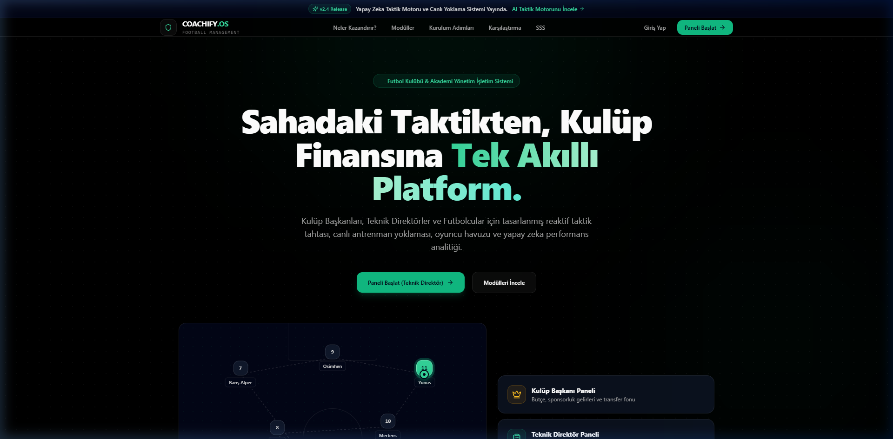
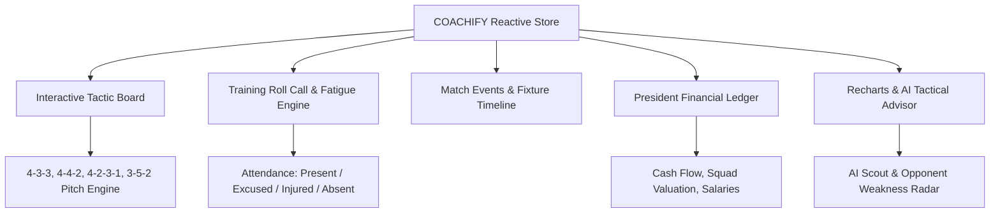
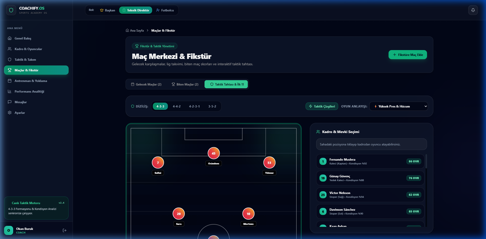
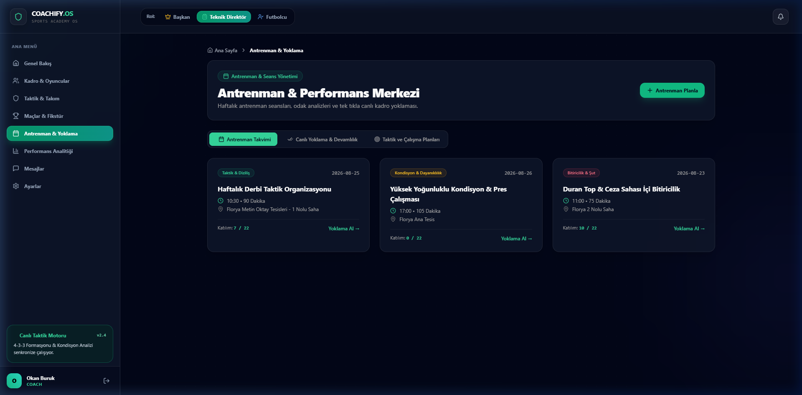
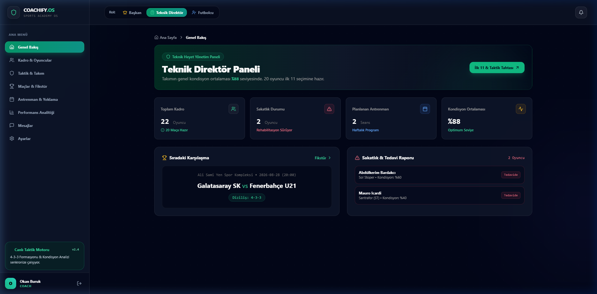
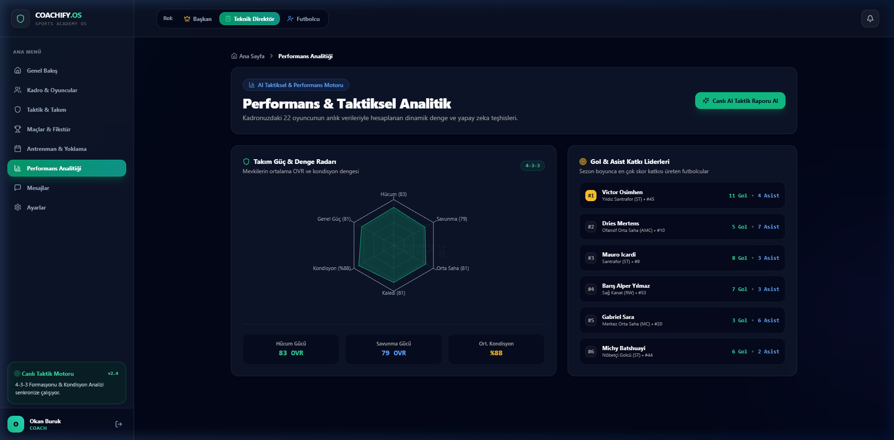

# COACHIFY.OS

<p align="center">
  <a href="README.md">🇬🇧 English</a> •
  <a href="README.tr.md">🇹🇷 Türkçe</a>
</p>

---

[](https://reactjs.org/)
[](https://www.typescriptlang.org/)
[](https://vitejs.dev/)
[](https://tailwindcss.com/)
[](https://www.framer.com/motion/)
[](https://vitest.dev/)
[](https://opensource.org/licenses/Apache-2.0)

**COACHIFY.OS** is a high-performance, AI-assisted Football Club & Sports Academy Operating System. It unifies **interactive tactic boards, real-time training roll-calls, match timeline recording, multi-role portals (Club President, Head Coach, Player), and financial analytics** in a unified reactive architecture.

<p align="center">
  
</p>

---

## Architecture & Modules



### 1. Interactive Pitch & Tactic Board
- Visual grass pitch supporting multiple standard tactical formations (`4-3-3`, `4-4-2`, `4-2-3-1`, `3-5-2`).
- Real-time squad lineup assignment, tactical mentality selectors, captain, penalty, and free-kick assignments.

<p align="center">
  
</p>

### 2. Training Planner & Live Roll Call
- Schedule drills focused on **Tactics, Conditioning, Shooting, Passing, or Goalkeeping**.
- 1-click squad roll call tracker with 4 status states (*Present, Excused, Injured, Absent*).

<p align="center">
  
</p>

### 3. Multi-Role Unified Portals
- **President**: Total squad valuation, income/expense ledger, transfer budgets, sponsorship agreements.
- **Head Coach**: Next match tactical readiness, squad fitness average, weekly sessions, and injury radar.
- **Player**: Individual match rating, goals/assists, fitness radar, attendance score, and coach feedback.

<p align="center">
  
</p>

### 4. Performance Analytics & AI Advisor
- Radar charts for squad balance (Offense, Defense, Midfield, Goalkeeping, Fitness, Overall OVR).
- Automated AI Tactical Advisor generating scouting insights and substitution suggestions for upcoming fixtures.

<p align="center">
  
</p>

---

## Quick Start

```bash
# Clone the repository
git clone https://github.com/adacreativeco/coachify.git
cd coachify

# Install dependencies
npm install

# Run development server
npm run dev

# Run automated test suite
npm test

# Build production bundle
npm run build
```

---

## License
Licensed under the Apache License 2.0. Developed by [ADA Creative Co.](https://github.com/adacreativeco).
