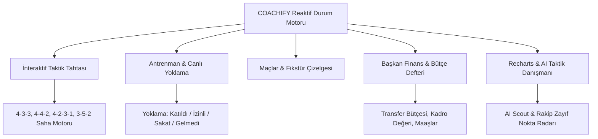

# COACHIFY.OS

<p align="center">
  <a href="README.md">🇬🇧 English</a> •
  <a href="README.tr.md">🇹🇷 Türkçe</a>
</p>

---

[](https://reactjs.org/)
[](https://www.typescriptlang.org/)
[](https://vitejs.dev/)
[](https://tailwindcss.com/)
[](https://www.framer.com/motion/)
[](https://vitest.dev/)
[](https://opensource.org/licenses/Apache-2.0)

**COACHIFY.OS**, profesyonel futbol kulüpleri ve akademiler için geliştirilmiş reaktif bir kulüp yönetim işletim sistemidir. **İnteraktif taktik tahtası, canlı antrenman yoklaması, maç olay çizelgesi, çoklu rol panelleri (Kulüp Başkanı, Teknik Direktör, Futbolcu) ve finansal bütçe yönetimini** tek bir modern platformda birleştirir.

<p align="center">
  
</p>

---

## Mimari & Modüller



### 1. İnteraktif Yeşil Saha & Taktik Tahtası
- Modern taktiksel formasyon desteği (`4-3-3`, `4-4-2`, `4-2-3-1`, `3-5-2`).
- Gerçek zamanlı ilk 11 ataması, taktiksel anlayış, kaptan, penaltıcı ve duran top kullanıcılarının seçimi.

<p align="center">
  
</p>

### 2. Antrenman Planlama & Canlı Yoklama
- **Taktik, Kondisyon, Şut, Pas ve Kaleci** odaklı seans planlama.
- 4 durumlu tek tıkla canlı katılım takip masası (*Katıldı, İzinli, Sakat, Gelmedi*).

<p align="center">
  
</p>

### 3. Çoklu Rol Panelleri
- **Kulüp Başkanı**: Kadro piyasa değeri, gelir/gider çift taraflı kayıt defteri, transfer bütçesi ve sponsorluklar.
- **Teknik Direktör**: Maç günü taktik hazırlığı, ortalama kondisyon (%88), haftalık seanslar ve sakatlık radarı.
- **Futbolcu**: Bireysel maç puanı, gol/asist katkısı, kondisyon grafiği, antrenman devamlılığı ve hoca notları.

<p align="center">
  
</p>

### 4. Performans Analitiği & Yapay Zeka Danışmanı
- Kadro denge radarı (Hücum, Savunma, Orta Saha, Kaleci, Kondisyon, Genel Güç).
- Otomatik AI Taktik Motoru ile rakip analizi, sakatlık ikazı ve oyuncu değişikliği tavsiyeleri.

<p align="center">
  
</p>

---

## Hızlı Başlangıç

```bash
# Depoyu klonlayın
git clone https://github.com/adacreativeco/coachify.git
cd coachify

# Bağımlılıkları yükleyin
npm install

# Geliştirme sunucusunu başlatın
npm run dev

# Testleri çalıştırın
npm test

# Üretim paketini derleyin
npm run build
```

---

## Lisans
Apache License 2.0 ile lisanslanmıştır. [ADA Creative Co.](https://github.com/adacreativeco) tarafından geliştirilmiştir.
