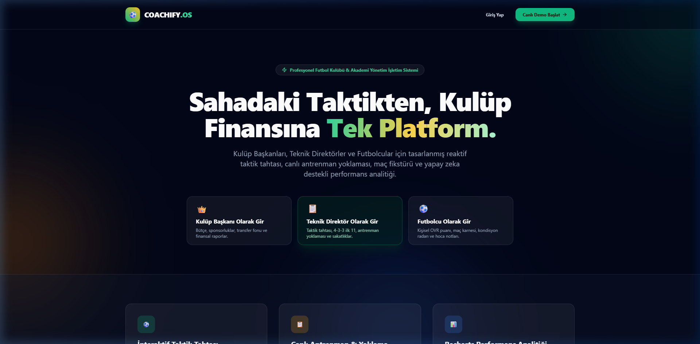
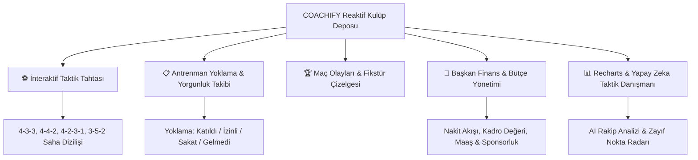
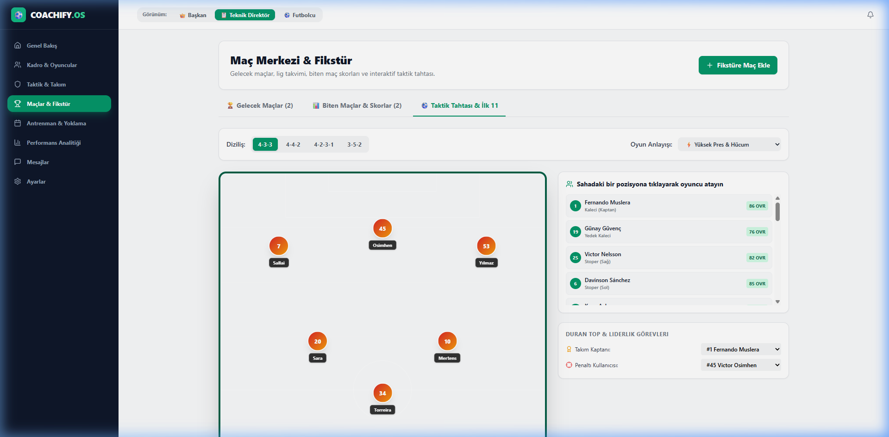
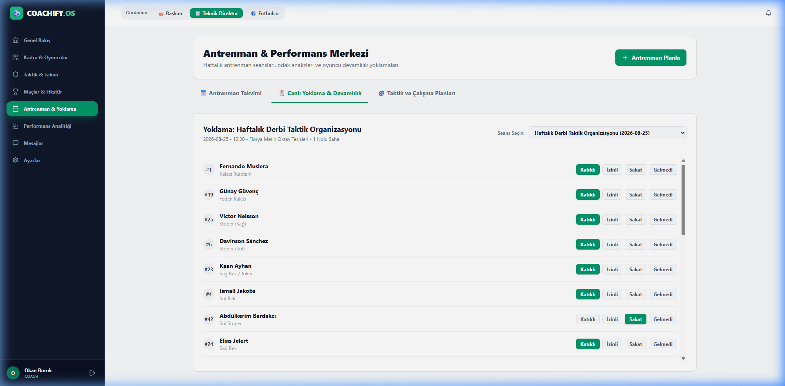
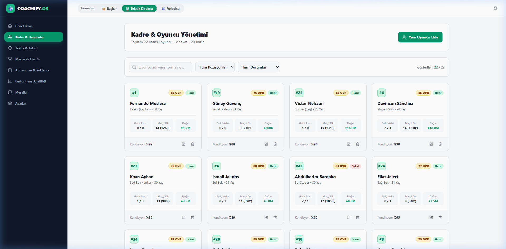
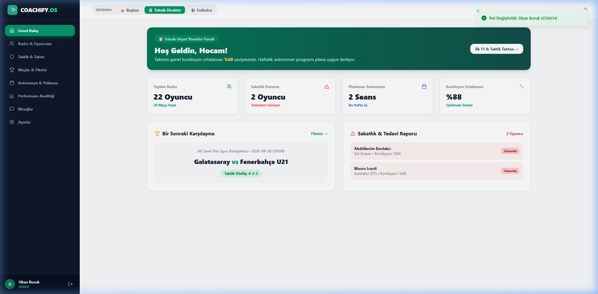
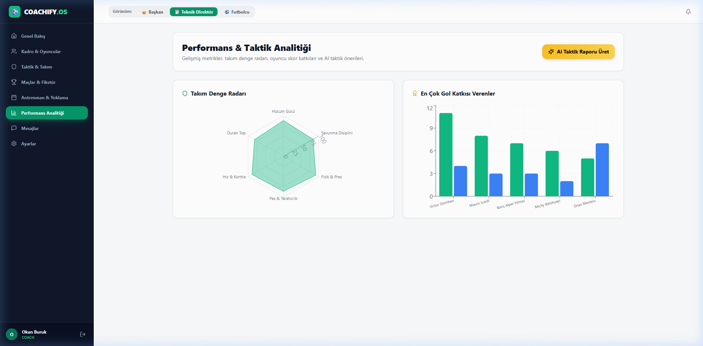

# ⚽ COACHIFY.OS

<p align="center">
  <a href="README.md">🇬🇧 English</a> •
  <a href="README.tr.md">🇹🇷 Türkçe</a>
</p>

---

[](https://reactjs.org/)
[](https://www.typescriptlang.org/)
[](https://vitejs.dev/)
[](https://tailwindcss.com/)
[](https://vitest.dev/)
[](https://github.com/adacreativeco/coachify/actions)
[](https://opensource.org/licenses/Apache-2.0)

**COACHIFY.OS**, profesyonel futbol kulüpleri ve spor akademileri için geliştirilmiş, yapay zeka destekli yeni nesil kulüp yönetim işletim sistemidir. **İnteraktif yeşil saha taktik tahtası, canlı antrenman yoklaması, maç olay akışı, 3 farklı rol paneli (Başkan, Teknik Direktör, Futbolcu) ve finansal bütçe yönetimini** tek bir reaktif mimaride birleştirir.

<p align="center">
  
</p>

---

## 🌟 Temel Modüller & Mimari



### 1. ⚽ İnteraktif Saha & Taktik Tahtası
* `4-3-3`, `4-4-2`, `4-2-3-1`, `3-5-2` formasyonlarında ilk 11 belirleme.
* Kaptan, penaltıcı, frikikçi ve kornerci atamaları; hücum/savunma anlayışı seçimi.

<p align="center">
  
</p>

### 2. 📋 Antrenman Planlama & Canlı Yoklama
* Taktik, Kondisyon, Şut, Pas ve Kaleci odaklı seans oluşturma.
* Tek tıkla tüm kadronun katılım yoklamasını (*Katıldı, İzinli, Sakat, Gelmedi*) alma motoru.

<p align="center">
  
</p>

### 3. 👥 Kadro & Oyuncu Yönetimi
* 22 kişilik zengin kadro, OVR reytingleri, sakatlık takibi, piyasa değerleri ve anlık oyuncu ekleme/düzenleme.

<p align="center">
  
</p>

### 4. 👑 3 Farklı Kullanıcı Rol Portali
* **👑 Kulüp Başkanı**: Toplam kadro değeri (€91.2M), gelir/gider kaydı, transfer bütçesi, sponsorluk anlaşmaları.
* **📋 Teknik Direktör**: Sıradaki maç taktiği, takım kondisyon ortalaması (%88), sakatlık radarı ve antrenman takvimi.
* **⚽ Futbolcu**: Bireysel maç karnesi, kondisyon radarı, antrenman devamlılığı ve hocanın taktik notları.

<p align="center">
  
</p>

### 5. 📊 Performans Analitiği & AI Danışmanı
* Takım denge radarı (Hücum, Savunma, Fizik, Pas, Hız, Disiplin).
* Rakip analizine göre anlık taktiksel öneriler üreten yapay zeka asistanı.

<p align="center">
  
</p>

---

## 🚀 Hızlı Başlangıç

```bash
# Depoyu klonlayın
git clone https://github.com/adacreativeco/coachify.git
cd coachify

# Bağımlılıkları yükleyin
npm install

# Geliştirme sunucusunu başlatın
npm run dev

# Otomatik Vitest testlerini çalıştırın (8/8 test başarılı)
npm test

# Prodüksiyon derlemesini alın
npm run build
```

---

## 📄 Lisans
Apache License 2.0 ile lisanslanmıştır. [ADA Creative Co.](https://github.com/adacreativeco) tarafından geliştirilmiştir.
