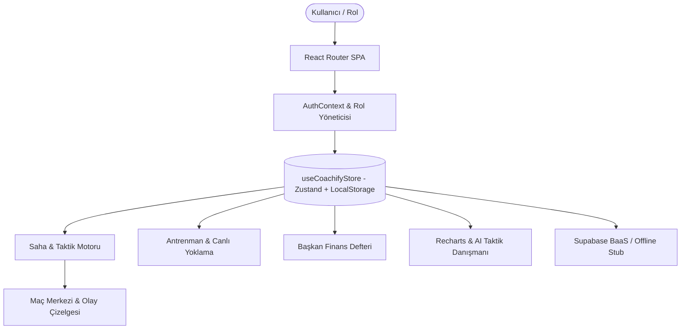

# COACHIFY.OS Mimari Belgesi (Architecture Guide)

COACHIFY.OS, modern React 18, TypeScript, TailwindCSS ve Zustand kullanılarak geliştirilmiş tam reaktif bir spor kulübü yönetim işletim sistemidir.

## 🏗️ Katmanlar
1. **İstemci Durum Katmanı (`src/stores/coachifyStore.ts`):** Tüm kulüp verilerini (oyuncular, maçlar, seanslar, bütçe) yerel kalıcılıkla (LocalStorage) yönetir.
2. **Yetki Katmanı (`src/contexts/AuthContext.tsx`):** 3 ana rol (Başkan, Hoca, Oyuncu) arasında anlık geçiş ve brute-force koruması sağlar.
3. **Doğrulama Katmanı (`src/lib/validations.ts`):** Girdi sınırları, OVR aralıkları ve dosya yükleme sınırlarını kontrol eder.
4. **Veritabanı Güvenliği (`supabase/rls_policies.sql`):** Supabase üzerinde yetkisiz okuma ve yazmaları engelleyen RLS kurallarını içerir.
